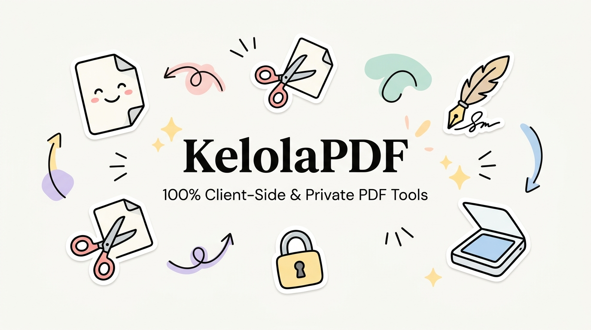

<div align="center">



# KelolaPDF
### Perkakas Manipulasi Dokumen PDF Lengkap, Cepat, dan 100% Privat di Browser
**[kelolapdf.web.id](https://kelolapdf.web.id)**

[](https://nextjs.org/)
[](https://www.typescriptlang.org/)
[](https://tailwindcss.com/)
[](#keunggulan-arsitektur)
[](#keunggulan-arsitektur)
[](LICENSE)

<br />

**KelolaPDF** adalah platform web perkakas PDF alternatif iLovePDF buatan anak bangsa yang beroperasi sepenuhnya di peramban pengguna (*client-side*). Seluruh proses penggabungan, pemotongan, kompresi, enkripsi, hingga OCR dieksekusi langsung di perangkat Anda tanpa pernah mengunggah berkas ke server pihak ketiga.

</div>

---

## 🌟 Mengapa KelolaPDF?

| Fitur | 🛡️ KelolaPDF | ☁️ Layanan PDF Konvensional |
|---|---|---|
| **Lokasi Pemrosesan** | **100% di browser laptop/ponsel Anda** | Diunggah ke server pihak ketiga |
| **Keamanan Data Sensitif** | **Zero Data Leak** (KTP, slip gaji, ijazah tidak pernah bocor) | Berisiko diintip atau tersimpan di server cloud |
| **Kecepatan** | **Instan** (0 detik antre upload/download berkas) | Tergantung bandwidth & kuota upload internet |
| **Biaya Operasional** | **Rp 0 / Zero Server Cost** | Membutuhkan server mahal untuk komputasi |
| **Batasan Dokumen** | Bebas kuota harian & tanpa watermark paksaan | Dibatasi per jam / dipaksa langganan VIP |

---

## 🧰 Katalog 18 Perkakas PDF

### 1. 📑 Pengorganisasian Halaman
- **📚 Gabung PDF:** Menyatukan beberapa berkas PDF menjadi satu dokumen berurutan.
- **✂️ Pisah PDF:** Mengambil halaman tertentu atau memisahkan dokumen berdasarkan rentang halaman (misal: `1-3, 5`).
- **📋 Atur & Urutkan Halaman:** Drag & drop visual thumbnail untuk menyusun ulang, menghapus, atau menduplikasi halaman.
- **🔄 Putar Halaman:** Memperbaiki orientasi halaman yang miring/terbalik (90°, 180°, 270°).
- **📐 Potong Margin (Crop):** Memangkas tepi kosong atau menyesuaikan area tampilan halaman.
- **📏 Ubah Ukuran Kertas:** Menyesuaikan ukuran halaman ke standar A4, US Letter, atau F4 (Folio).

### 2. ⚡ Optimasi & Teks
- **🗜️ Perkecil Ukuran (Compress):** Mengompresi ukuran PDF hasil scan agar ringan dikirim lewat email atau diunggah ke portal pendaftaran.
- **🔍 OCR (Scan ke Teks):** Mendeteksi teks dari lembar scan/foto menggunakan WebAssembly agar teks bisa dicari (*Ctrl + F*) dan disalin.
- **🔢 Nomor Halaman:** Menambahkan penomoran otomatis di header/footer dengan opsi lewati halaman cover.
- **🏷️ Edit Metadata:** Memeriksa dan mengubah judul (*Title*), nama penulis (*Author*), subjek, dan kata kunci dokumen.

### 3. 🔄 Konversi & Media
- **🖼️ Gambar ke PDF:** Mengubah foto JPG, PNG, atau scan dari ponsel menjadi dokumen PDF rapi.
- **📸 PDF ke Gambar:** Mengubah tiap halaman PDF menjadi berkas gambar resolusi tinggi (unduh satuan atau ZIP).
- **📦 Ekstrak Gambar Asli:** Mengambil seluruh aset foto/logo yang tertanam di dalam PDF dalam resolusi aslinya.

### 4. 🔒 Keamanan & Legalitas
- **✍️ Tanda Tangan Digital (E-Sign):** Menggambar tanda tangan, mengetik nama latin, atau menempel stempel paraf transparan di halaman mana pun.
- **⬛ Sensor Data Sensitif (Redact):** Menutup permanen (*blackout*) bagian NIK, nomor rekening, alamat, atau paraf sebelum disebarkan.
- **🔐 Kunci & Enkripsi PDF:** Melindungi dokumen rahasia dengan kata sandi pengaman.
- **🔓 Buka Kunci (Unlock):** Menghapus proteksi password yang melekat jika Anda mengetahui kata sandinya.
- **🏷️ Watermark Dokumen:** Memberikan cap teks kustom seperti *"DRAFT"* atau *"RAHASIA"* dengan posisi dan transparansi bebas.

---

## 🛠️ Teknologi yang Digunakan

- **Framework:** [Next.js](https://nextjs.org/) (App Router, Turbopack)
- **Bahasa:** [TypeScript](https://www.typescriptlang.org/)
- **Styling:** [Tailwind CSS v4](https://tailwindcss.com/)
- **Desain & Ikon:** [Lucide Icons](https://lucide.dev/) (Estetika Notion)
- **Manipulasi PDF:** [`@cantoo/pdf-lib`](https://github.com/CantooScribe/pdf-lib) (Mendukung enkripsi & manipulasi tingkat lanjut)
- **Rendering & Viewer:** [`pdfjs-dist`](https://mozilla.github.io/pdf.js/) (Mozilla PDF Engine)
- **OCR WebAssembly:** [`tesseract.js`](https://tesseract.projectnaptha.com/)
- **Arsip Multi-Berkas:** [`jszip`](https://stuk.github.io/jszip/)

---

## 🚀 Memulai di Komputer Lokal

### Prasyarat
- Node.js versi 18+ atau 20+
- npm atau pnpm / yarn

### Instalasi & Menjalankan

```bash
# 1. Clone repositori
git clone https://github.com/USERNAME/kelolapdf.git
cd kelolapdf

# 2. Instal dependensi
npm install

# 3. Jalankan server lokal
npm run dev
```

Buka peramban di [http://localhost:3000](http://localhost:3000) untuk melihat antarmuka KelolaPDF.

### Build untuk Produksi

```bash
npm run build
```

---

## 🌐 Panduan Deploy ke Vercel (kelolapdf.web.id)

1. **Push ke GitHub:**
   ```bash
   git add .
   git commit -m "feat: inisialisasi KelolaPDF"
   git push -u origin main
   ```
2. **Impor ke Vercel:**
   - Kunjungi [Vercel Dashboard](https://vercel.com/new).
   - Pilih repositori `kelolapdf` dan klik **Deploy**.
3. **Konfigurasi Domain:**
   - Masuk ke tab **Settings** → **Domains**.
   - Tambahkan domain: `kelolapdf.web.id`.
   - Di panel DNS registrar domain Anda, arahkan CNAME record ke `cname.vercel-dns.com`.

---

## 📄 Lisensi

Proyek ini dirilis di bawah lisensi [MIT](LICENSE). Bebas digunakan, dimodifikasi, dan didistribusikan.
